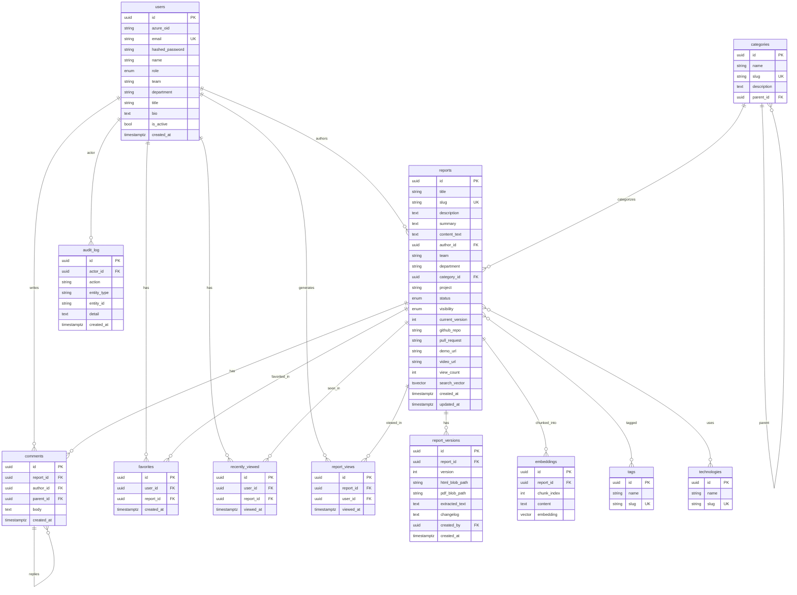

# Entity-Relationship Diagram — Kelp Nexus

## Indexes & constraints

- `reports.slug`, `categories.slug`, `tags.slug`, `technologies.slug` — unique.
- `reports.search_vector` — GIN index (`ix_reports_search_vector`).
- `embeddings.embedding` — ivfflat cosine index (`ix_embeddings_vector`).
- `report_versions(report_id, version)` — unique.
- `favorites(user_id, report_id)` & `recently_viewed(user_id, report_id)` — unique.
- `report_views.viewed_at` — indexed for trending/analytics windows.
