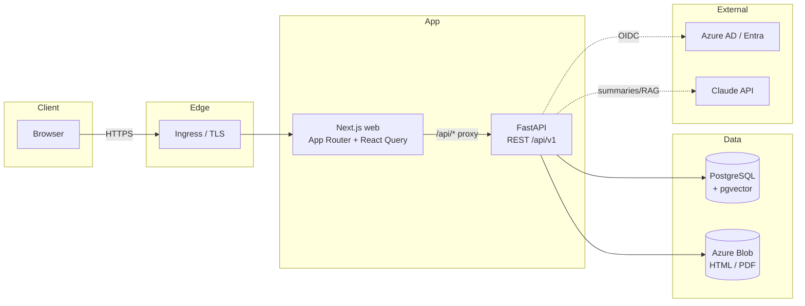
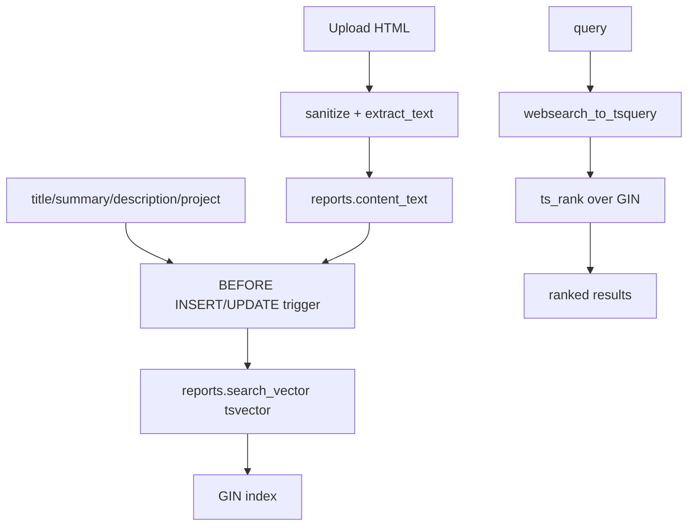
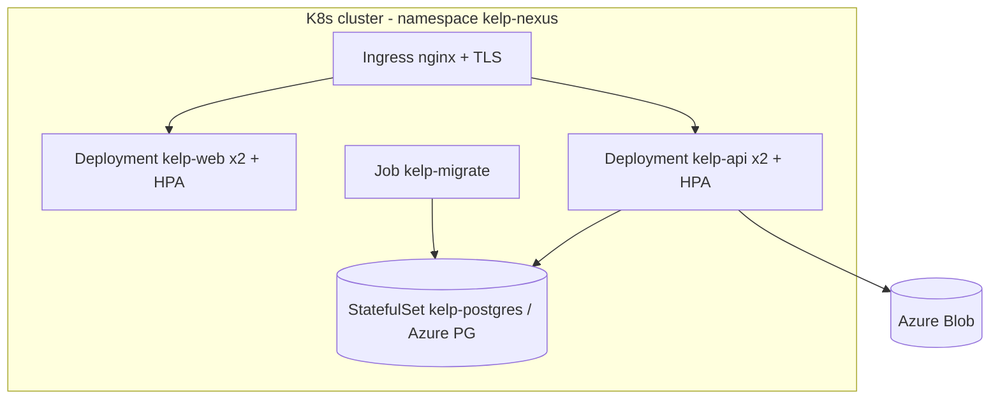
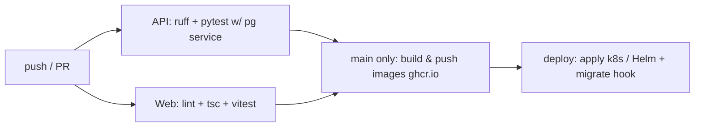

# Technical Design Document — Kelp Nexus

## 1. System overview

Kelp Nexus is a monorepo with a Next.js frontend and a FastAPI backend backed by
PostgreSQL (+ pgvector) and Azure Blob storage. The web app proxies `/api/*` to
the API so the browser and API share a same-origin httpOnly session cookie.



## 2. Backend architecture

Layered: `routers` (HTTP) → `services` (business logic) → `db.models` (SQLAlchemy).
Cross-cutting concerns live in `core` (config, security, deps/RBAC, azure_ad).

- **config.py** — pydantic-settings, env-driven; single `settings` singleton.
- **security.py** — bcrypt password hashing, JWT issue/verify.
- **deps.py** — `get_current_user`, `get_optional_user`, `require_role(min)` (role
  hierarchy admin>editor>author>viewer).
- **services/storage.py** — `BlobStorage` over Azure Blob (Azurite locally).
- **services/html_sanitize.py** — `sanitize_html` (bleach allowlist) + `extract_text`.
- **services/search.py** — `full_text_search` over `tsvector` with facets.
- **services/ai.py** — Claude summaries/tags/embeddings; no-ops when disabled.
- **services/taxonomy.py** — slug generation + tag/technology upsert.

## 3. Authentication flow (Azure AD OIDC + dev fallback)

```mermaid
sequenceDiagram
  participant U as User
  participant W as Web
  participant A as API
  participant AAD as Azure AD

  Note over U,AAD: SSO path
  U->>W: Click "Sign in with Microsoft"
  W->>A: GET /auth/login
  A->>AAD: redirect (authorize)
  AAD-->>U: login + consent
  AAD->>A: GET /auth/callback?code
  A->>AAD: exchange code → id_token (oid, email)
  A->>A: upsert User(azure_oid), issue session JWT
  A-->>W: Set-Cookie access_token (httpOnly); redirect /dashboard

  Note over U,A: Dev path (DEV_LOGIN=true)
  U->>A: POST /auth/dev-login {email,password}
  A->>A: verify bcrypt, issue JWT
  A-->>U: Set-Cookie access_token
```

The session JWT (`sub`=user id, `role`) is the single source of identity for the
rest of the API; the IdP is abstracted away after callback.

## 4. Storage design

- HTML and PDF binaries live in **Azure Blob** under
  `reports/{report_id}/v{n}/report.{html,pdf}`. The DB stores only blob paths +
  extracted plain text.
- On upload the API **sanitizes HTML** (bleach) before storing; the stored copy is
  the trusted artifact. The `/reports/{id}/render` endpoint streams it back with a
  strict CSP for the sandboxed iframe.
- Local dev uses **Azurite**; production uses an Azure Storage account (prefer
  private endpoint + SAS download URLs).

## 5. Search architecture



- Weighted `tsvector`: title (A), summary (B), description (C), project+content (D).
- Maintained by a Postgres trigger so writes stay simple and ranking is consistent.
- **Pluggable semantic search**: the `embeddings` table (pgvector, cosine ivfflat
  index) and `SemanticSearch` interface are ready; Phase 2 wires real embeddings
  and a `semantic=true` toggle on `/search`.

## 6. Data model

See [ER.md](ER.md). Key tables: `users`, `reports`, `report_versions`,
`categories`, `tags`, `technologies` (+ join tables), `comments`, `favorites`,
`recently_viewed`, `report_views`, `embeddings`, `audit_log`.

## 7. Secure HTML rendering

Three layers of defense:
1. **Ingest sanitization** — bleach allowlist strips `<script>`, event handlers,
   and `javascript:` URIs.
2. **Response headers** — the render endpoint sets `Content-Security-Policy:
   default-src 'none'; img-src https: data:; style-src 'unsafe-inline'` and
   `X-Content-Type-Options: nosniff`.
3. **Sandboxed iframe** — the viewer omits `allow-same-origin` and `allow-scripts`,
   so the document cannot run JS, read cookies, or reach the parent origin.

## 8. API

REST under `/api/v1`, OpenAPI auto-generated by FastAPI (`/openapi.json`,
Swagger at `/docs`). See [API.md](API.md) for the contract summary.

## 9. Deployment



Containers are built and pushed by GitHub Actions; the migrate Job runs
`alembic upgrade head` before API pods roll. See
[deployment-guide.md](deployment-guide.md).

## 10. CI/CD



## 11. Key technical decisions

| Decision | Rationale |
|----------|-----------|
| Postgres FTS before a search engine | Zero extra infra; sufficient to ~100k docs; pgvector path already in schema |
| Blob for HTML/PDF, text in DB | Cheap durable binaries; DB stays small and searchable |
| Sanitize **and** sandbox | Defense in depth; either layer alone is insufficient |
| Session JWT after OIDC | Provider-agnostic API; easy dev fallback |
| Monorepo | Shared types, single CI, coordinated releases |
| AI behind a flag | Portal fully works without an API key; graceful degradation |
